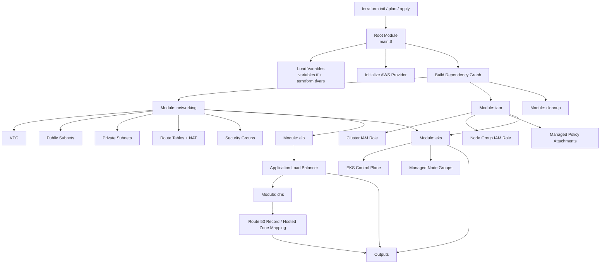
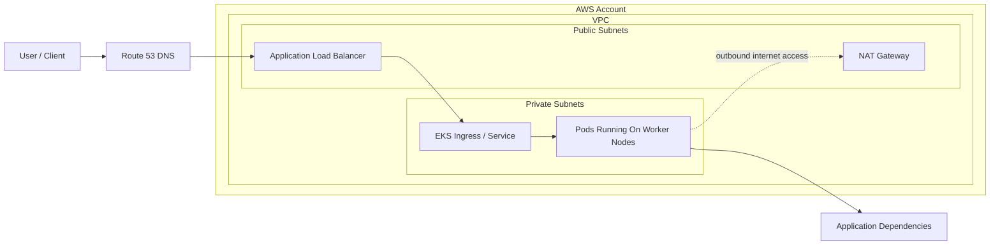
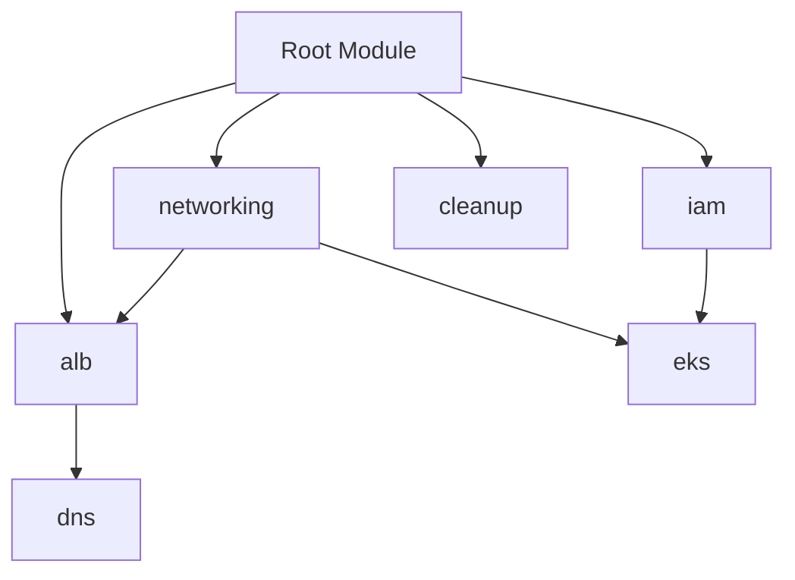

# EKS Cluster Presentation Guide

This document is designed for presentations. It explains how the project starts, how Terraform builds the environment, and how traffic flows once the platform is running.

## 1. Presentation Summary

This project uses Terraform to provision a modular Amazon EKS platform on AWS.

The flow starts in the root Terraform module, which orchestrates six main responsibilities:

- `networking` creates the VPC, subnets, route tables, NAT gateways, and security groups.
- `iam` creates the IAM roles and policy attachments required by EKS.
- `eks` creates the EKS control plane and managed node groups.
- `alb` creates the Application Load Balancer used for inbound traffic.
- `dns` connects the domain name to the load balancer.
- `cleanup` handles pre-destroy steps so infrastructure can be removed cleanly.

## 2. How The Flow Starts

When Terraform runs, the startup sequence is:

1. Terraform loads the root module configuration from `main.tf`.
2. Variables are read from `variables.tf` and `terraform.tfvars`.
3. The AWS provider is initialized using the selected region.
4. Terraform builds the dependency graph between modules.
5. Core infrastructure is created in order:
   - networking first
   - IAM second
   - EKS after networking and IAM
   - ALB after networking
   - DNS after ALB
6. Outputs are exposed so operators can connect to the cluster and related resources.

## 3. Provisioning Flow Diagram

## 4. Runtime Traffic Flow Diagram

This is the easiest diagram to use when explaining how user traffic reaches workloads inside Kubernetes.

## 5. Module Dependency Diagram

This diagram is useful when explaining why the project is modular and why Terraform creates resources in a safe order.

## 6. Talk Track For Presentation

Use this script if you want a simple explanation while presenting:

### Slide 1: What this project does

"This Terraform project provisions a complete EKS environment on AWS. It separates infrastructure into modules so networking, IAM, compute, ingress, and DNS can be managed independently but deployed together."

### Slide 2: How it starts

"The process starts from the root module. Terraform reads the input variables, initializes the AWS provider, and builds a dependency graph. That graph ensures the VPC and IAM roles exist before the EKS cluster is created."

### Slide 3: How the platform is built

"Networking creates the VPC, public and private subnets, NAT gateways, and security groups. IAM creates the cluster and node roles. Then EKS provisions the control plane and worker nodes in private subnets. After that, the ALB and DNS modules expose the application."

### Slide 4: How traffic flows

"A client request goes to Route 53, then to the Application Load Balancer, then into Kubernetes services and pods running on EKS worker nodes. The worker nodes stay in private subnets, which improves security, while outbound traffic uses NAT."

### Slide 5: Why cleanup matters

"The cleanup module exists so the environment can be destroyed safely. It removes Kubernetes-managed AWS resources and scales down node groups before Terraform tears down the network."

## 7. Key Architecture Points To Highlight

- The EKS control plane is managed by AWS.
- Worker nodes run in private subnets.
- Public access is handled through the ALB, not by exposing nodes directly.
- NAT gateways provide outbound internet access for private workloads.
- IAM roles are separated between the control plane and worker nodes.
- Terraform modules keep the project reusable and easier to maintain.

## 8. Recommended Presentation Order

1. Start with the problem the platform solves.
2. Show the provisioning flow diagram.
3. Show the runtime traffic flow diagram.
4. Explain module dependencies.
5. End with security and operational benefits.

## 9. Presenter Notes

- If the audience is technical, emphasize dependency order and private subnet design.
- If the audience is non-technical, focus on the high-level path: Terraform -> AWS infrastructure -> EKS -> application traffic.
- If asked why Terraform is used, the answer is consistency, repeatability, and modular infrastructure management.
